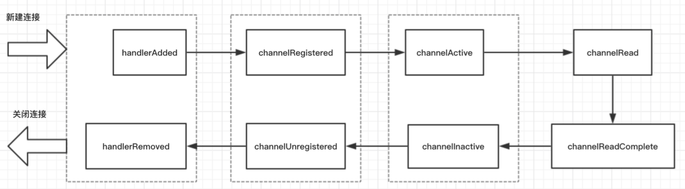

## 使用Netty实现IM

### ChannelHandler生命周期

1. `handlerAdded()`当检测到新连接之后，调用`ch.pipeline().addLast(new LifeCycleTestHnalder());`之后的回调，
表示在当前的channel中，已经成功添加一个handler处理器；
2. `channelRegistered`回调方法表示当前channel的所有的逻辑处理已经和某个NIO线程【NioEventLoop】建立了绑定关系；
3. `channelActive`当channel的所有的业务逻辑准备完毕以及绑定好NIO线程之后，会回调此方法；
4. `channelRead`客户端向服务端发来数据，每次都会回调此方法，表示有数据可读；
5. `channelReadComplete`服务端每次读完一次完整的数据之后，回调该方法，表示数据读取完毕。
6. `channelInactive`连接关闭，连接在TCP层面不是ESTABLISH状态；
7. `channelUNregistered`连接关闭，与此连接绑定的线程移除对连接的处理；
8. `handlerRemoved`连接关闭，添加到连接上的所有业务逻辑处理器都给移除掉。

### 减少主线程阻塞的操作并记录耗时

如果在channelRead0()中进行耗时操作，会拖慢在该NIO线程上的其他所有的channel，
所以耗时操作需要放置到业务线程池中处理，伪代码如下：

    protected void channelRead0(ChannelHandlerContext ctx, T packet) {
        threadPool.submit(new Runnable() {
            long begin = System.currentTimeMills();
            
            // 数据库或网络等其他耗时操作
            // writeAndFlush()
            ctx.channel().writeAndFlush().addListener(future -> {
                long time = System.currentTimeMills() - begin;
            });
        }) 
    }

### 工程结构介绍

    cn.xiaoyu.learning.im  
    +--client  
    |  \-console 控制台命令      
    |  \-handler 客户端处理器  
    |  \-NettyClient Netty客户端启动程序  
    +--codec 编解码器及拆包器  
    +--common 常量  
    +--handler   
    |  \-IMIdleStateHandler 空闲检测处理器  
    +--protocol  
    |  \-command 指令类型  
    |  \-request request请求契约  
    |  \-response response响应契约
    |  \-Packet 契约父类
    |  \-PacketCodeC 序列化和反序列化工具类
    +--serialize
    |  \-impl 序列化实现子类
    |  \-Serializer 序列化实现接口
    |  \-SerializerAlgorithm 序列化实现算法
    +--server
    |  \-handler 服务端处理器
    |  \-NettyServver Netty服务端启动程序
    +--util 工具类
  
### 启动过程

1. 运行NettyServer服务端；
2. 运行NettyClient客户端；
3. 输入姓名登录，进行其他操作。
