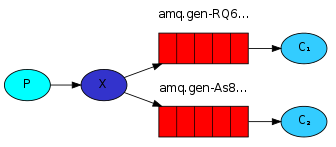
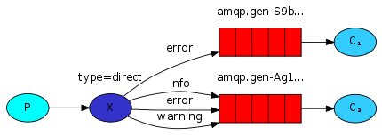
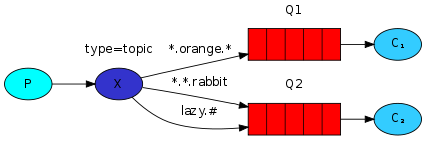

## 六种队列

> P：消息的生产者  
> C：消息的消费者  
> 红色：队列  

### 简单队列
  
生产者将消息发送到队列，消费者从队列中获取消息。  
[hellowolrd](./src/main/java/cn/xiaoyu/rabbit/hellowolrd)

### Work模式
  
一个生产者、2个消费者；一个消息只能被一个消费者获取。  
[workqueue](./src/main/java/cn/xiaoyu/rabbit/workqueue)

basicQos()设置当前信道最大预获取（prefetch）消息数量为1。消息从队列异步推送给消费者，
消费者的ack也是异步发送给队列，从队列的视角去看，总是会有一批消息已推送但尚未获得ack确认，
Qos的prefetchCount参数就是用来限制这批未确认消息数量的。设为1时，队列只有在收到消费者
发回的上一条消息ack确认后，才会向该消费者发送下一条消息。prefetchCount 的默认值为0，
即没有限制，队列会将所有消息尽快发给消费者。

**轮询分发 - Round Robin**

消息队列可以并行工作，如果工作队列中积压消息，可以添加消费者来提升系统的处理能力。
在默认情况下，RabbitMQ将逐个发送消息到序列中的下一个消费者，平均每个消费者获得相同数量的消息。

**公平分发**
当每个消费者的处理能力不同时，采用轮训分发就会出现部分消费者消息积压，而另外一部分消费者空闲。
此时可以采用basicQos(prefetchCount=1)来限制RabbitMQ只会发不超过1条的消息给同一个消费者，当
处理完成后，得到ack确认，才会进行第二次发送。

```java
// 每次只发送一条消息给消费者
channel.basicQos(1);
// 手动确认消息消费完成
channel.basicAck(envelope.getDeliveryTag(), false);

// 监听队列，false表示手动返回完成状态，true表示自动
channel.basicConsume(QUEUE_NAME, false, consumer);
```

### 发布订阅模式
  
一个生产者、多个消费者；每个消费者都有自己的队列，生产者没有将消息发送到队列，而是直接发送给
交换机exchange，每个队列都要绑定到交换机，生产者发送的消息，经过交换机，到达队列，实现，
一个消息被多个消费者获取的目的。

注意：一个消费者队列可以有多个消费者实例，只有其中一个消费者实例会消费  
[Publish/Subscribe](./src/main/java/cn/xiaoyu/rabbit/publish)

### 路由模式
  
一个生产者、多个消费者；每个消费者都有自己的队列且只订阅自己感兴趣的消息  
[Routing](./src/main/java/cn/xiaoyu/rabbit/routing)

### Topic模式
  
将路由键和某模式进行匹配，此时队列需要绑定一个模式，符号"#"匹配一个或多个词，符号"*"匹配
不多不少一个词。  
[Topic](./src/main/java/cn/xiaoyu/rabbit/topic)
