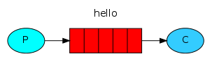
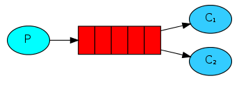

## 六种队列

> P：消息的生产者  
> C：消息的消费者  
> 红色：队列  

### 简单队列
  
生产者将消息发送到队列，消费者从队列中获取消息。  
[hellowolrd](./src/main/java/cn/xiaoyu/rabbit/hellowolrd)

### Work模式
  
一个生产者、2个消费者；一个消息只能被一个消费者获取。  
[workqueue](./src/main/java/cn/xiaoyu/rabbit/workqueue)

